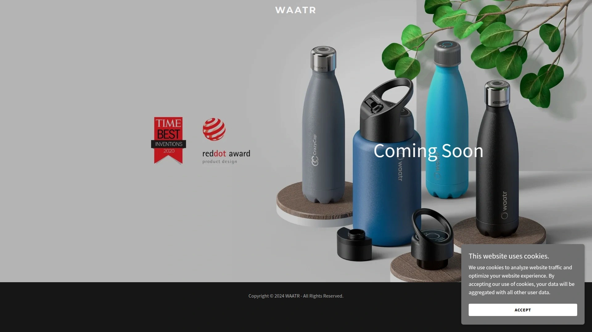
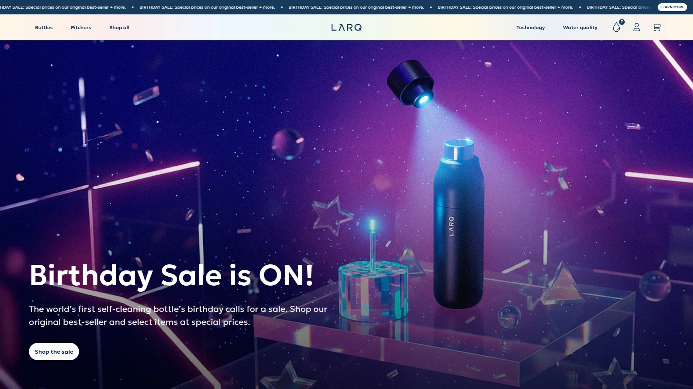
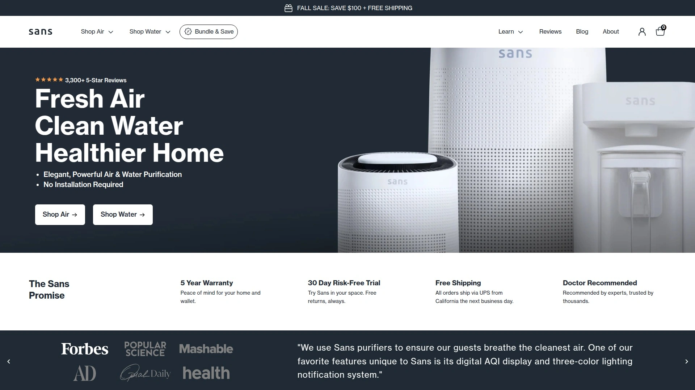
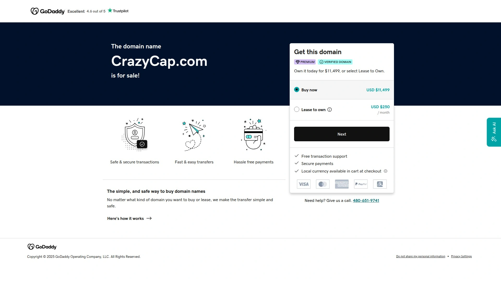
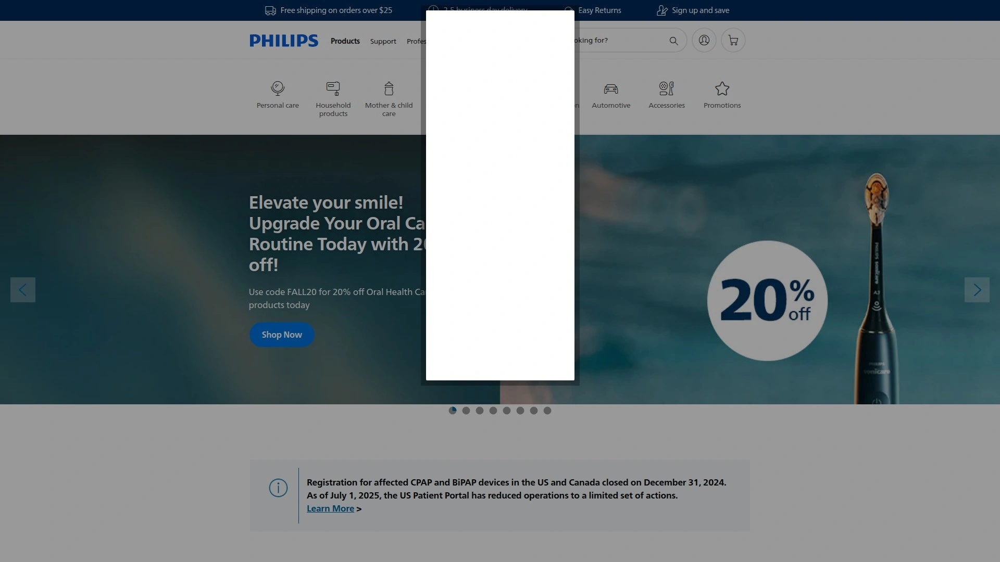
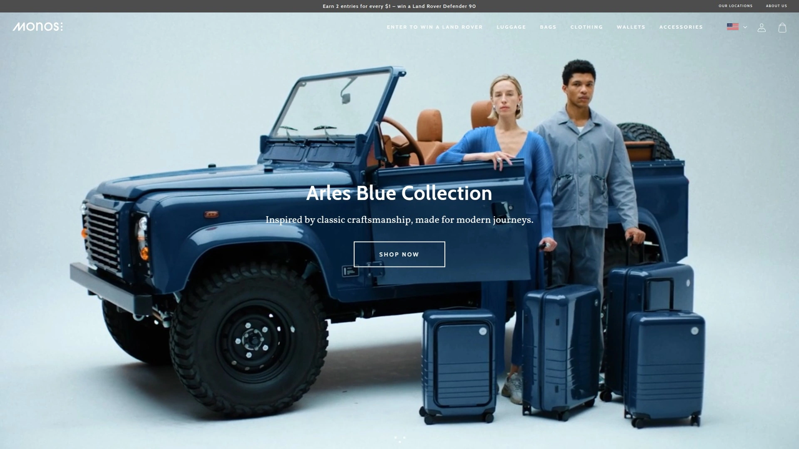
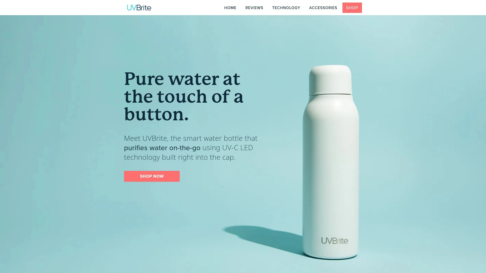
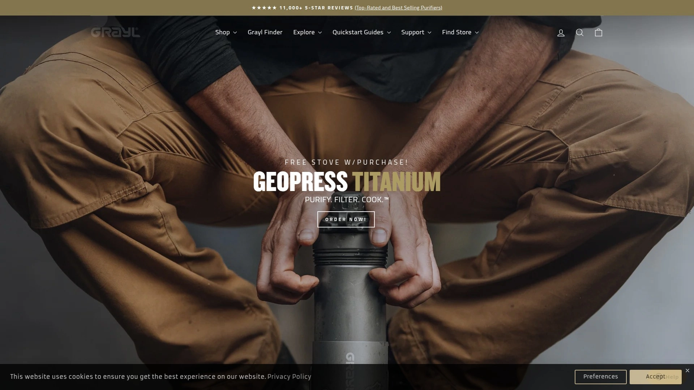
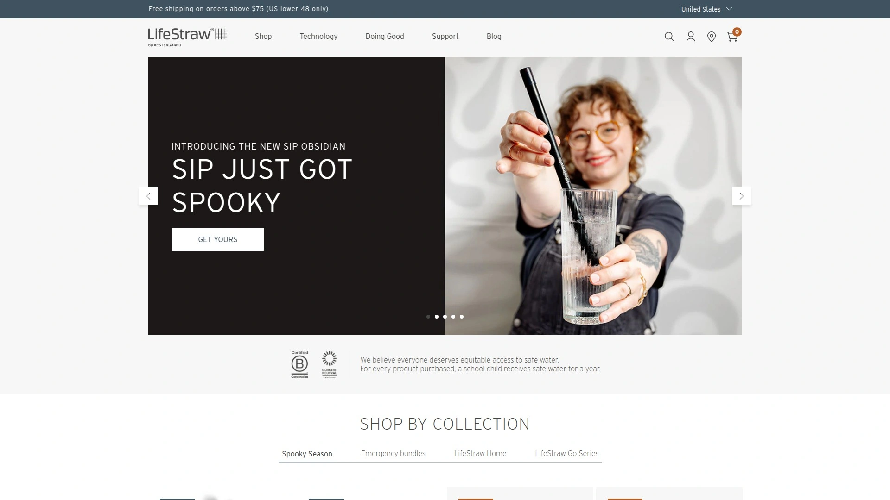
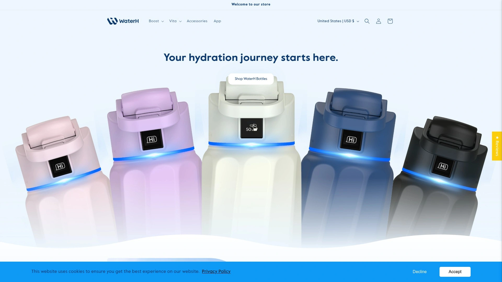

# 2025年十二大最佳UV-C自清洁水瓶

普通水瓶用几天就有股怪味,瓶底黏糊糊的细菌膜让人恶心,但每天拿刷子刷瓶子实在太麻烦了。现在有了UV-C自清洁水瓶,情况完全不一样。这些智能水瓶用紫外线LED灯自动杀死细菌和病毒,有的每两小时自动净化一次,有的还能过滤掉重金属和化学物质。不管你是户外徒步需要净化野外水源,还是健身房和办公室日常使用,选对一款能让你喝上真正干净的水,省掉每天清洗的麻烦。

***

## **[WAATR](https://waatr.com)**

4D净化技术加碳纤维过滤的全方位方案

WAATR采用独创的4D净化技术,结合20毫瓦双UV-C LED灯、碳纤维过滤系统和天然矿物质添加三重处理。按一下按钮,紫外线灯就会启动杀菌模式,一分钟内消灭水中的病毒、细菌和病原体。过滤系统能去除金属、化学物质、有机物和颗粒物,最后加入的矿物质混合物让水喝起来有天然泉水的口感。提供三种不同的过滤选项,可以根据水质情况定制过滤强度。

双层保温设计能让冷水保持24小时低温。荣获红点设计大奖,外观设计简洁现代。配备10年综合质保,远超行业标准。USB充电接口防水设计,充满电后可以使用约一个月。特别适合对水质要求高、希望一次性解决净化和过滤双重需求的用户。

---

## **[LARQ](https://www.livelarq.com)**

鲨鱼池明星产品的市场验证者

LARQ是最早进入自清洁水瓶市场的品牌之一,在美国电视节目Shark Tank上亮相后迅速走红。PureVis 2系列用专利UV-C技术消除99%的生物污染物,包括大肠杆菌等致病菌。每两小时自动启动一次清洁循环,同时净化水和瓶身内壁,特别适合像我这种会忘记刷瓶子的懒人。

按住瓶盖五秒可以关闭自动清洁进入旅行模式,省电延长续航。点击三下瓶盖启动冒险模式,紫外线强度提升3倍,净化时间延长到三分钟,效果相当于煮水20分钟,适合处理湖水等不确定水源。可以配备过滤吸管使用,用植物基纳米零技术去除99%的铅、PFAS和氯等污染物。保温效果能保持冷水24小时、热水12小时。瓶盖有彩色灯光系统提示当前模式和电量状态,充满电可以用一个月。提供23盎司和34盎司两种容量,售价109-116美元,30天无理由退货和一年质保。

***

## **[Sans](https://www.livesans.com)**

性价比突出的五年质保选择

Sans自清洁水瓶定价80美元,比LARQ便宜近30美元,但提供更长的五年完整质保。UV-C光净化技术每两小时自动清洁一次。17盎司容量配备双层真空保温,热水保持12小时、冷水24小时。硅胶提手方便携带。待机续航30天,日常使用每天净化2-3次可以用10天。

采用食品级不锈钢瓶身,瓶盖部分使用食品级PP聚丙烯塑料、PC聚碳酸酯塑料和硅胶材质,全部不含BPA。黑白两色可选,设计简洁耐看。提供30天免费家庭试用,不满意可以免费退货。适合预算有限但想要长期质保的用户。

---

## **[CrazyCap](https://crazycap.com)**

两个月超长续航的便携之选

CrazyCap 2如果只开启自动清洁模式,一次充电可以用两个月,是市面上续航最长的UV-C水瓶之一。提供两种净化模式:普通模式一分钟内杀灭几乎所有杂质,适合处理公共饮水机和自来水这类中低风险水源;疯狂模式超过两分钟可以杀灭100%有害物质,适合湖水和溪流等中高风险水源。

自动清洁模式每天启动5次,每次不到30秒,用短暂的紫外线照射防止微生物生长和异味产生。实测使用三天后瓶内没有任何气味或残留,过滤后的水味道明显好于直接接的自来水。采用锂电池供电,普通模式下充满电可以用一周以上。价格比LARQ更实惠,适合需要超长续航的差旅人士。

***

## **[Philips GoZero](https://www.usa.philips.com)**

大品牌背书的20盎司日常选择

飞利浦GoZero水瓶在瓶盖中内置UV-C LED灯,每两小时自动杀菌一次,防止异味细菌滋生。声称能消除99.999%的水生病原体和99.9%的病毒。20盎司容量正好满足日常需要,不用频繁续水。双层保温设计,瓶口比较宽方便洗碗机清洗。

瓶盖和瓶身之间有透明环,充电、净化和低电量时会显示不同颜色的灯光提醒。电池续航约30天,有低电量警告避免忘记充电。顶部带小提手可以挂在背包上。采用食品级不锈钢和BPA-free塑料。设计简洁现代,适合看重大品牌可靠性的用户。

***

## **[Monos Kiyo UVC](https://monos.com)**

旅行配件品牌的精致单品

Monos是做旅行箱起家的品牌,Kiyo UVC水瓶继承了他们一贯的简约设计风格。UV-C技术杀菌,保温性能出色,适合日常通勤和短途旅行。瓶身质感好,细节做工到位,颜值在同类产品中属于上游水平。价格定位中高端,适合追求品质和设计感的用户。

***

## **[UVBrite](https://uv-brite.com)**

一触即净的便携净化方案

UVBrite把UV-C LED技术直接集成在瓶盖里,按一下按钮就能启动净化。适合户外徒步时快速处理水源。轻便易携带,不占背包空间。充电方便,续航能满足周末露营需求。定价亲民,适合偶尔户外活动的轻度用户。

***

## **[HidrateSpark PRO](https://hidratespark.com)**

蓝牙追踪饮水量的智能管家

HidrateSpark PRO的核心不是UV净化,而是用SipSense技术精确追踪饮水量。瓶底的可拆卸蓝牙传感器通过称重记录你喝了多少水,准确度高达97%。自动同步到手机APP,能跟Apple Health、Fitbit、Google Fit等健康应用打通。

APP根据你的身高、体重、活动量等信息计算个性化的每日饮水目标,还会根据天气、海拔和运动量动态调整。瓶身可以发光提醒你喝水,有8种以上颜色可选,提醒频率和强度都能自定义。保温效果24小时,配压盖的杯型还能保热4小时。磁吸充电线几小时就能充满传感器。提供21盎司、24盎司、32盎司多种规格。适合需要严格管理饮水量的健身人群和需要医嘱控制水分摄入的人。

***

## **[Grayl GeoPress](https://grayl.com)**

8秒按压过滤的户外硬核装备

Grayl的工作原理完全不同于UV-C水瓶,它用物理按压方式把水挤过滤芯。GeoPress一次能过滤24盎司水,用力按压8秒就完成净化。不仅能过滤细菌和寄生虫,还能去除病毒、化学物质、重金属,甚至改善口感。

通过NSF/ANSI 42和53号协议认证,符合EPA微生物净水器测试标准。这种全面的过滤能力在背包客常用的过滤器中几乎独一无二。特别适合去发展中国家旅行,那些地方的水可能含有病毒和化学污染,普通滤水器搞不定。UltraPress是16.9盎司的紧凑版,适合空间有限的轻装出行。

缺点是滤芯寿命只有65加仑,需要30美元更换。相比之下Katadyn能过滤200加仑、Sawyer几乎终身使用。GeoPress售价约90美元,UltraPress约70美元。提供10年质保。更适合国际旅行和需要全面净化的场景,而不是日常徒步。

***

## **[LifeStraw Peak](https://lifestraw.com)**

可折叠超轻的多用途系统

LifeStraw Peak系列主打超轻便携,650毫升版本只有3.2盎司(约102克),1升版本也只有3.9盎司。可折叠设计收纳后几乎不占空间,适合越野跑和超轻徒步。材质比普通软水袋厚两倍,不容易破损漏水。

微孔过滤膜能挡住99.999999%的细菌、99.999%的寄生虫和微塑料,以及泥沙和浑浊物。滤芯寿命长达2000升(500加仑),性价比比Grayl高得多。可以当吸管直接喝、挤压到其他容器、拆掉滤芯当储水袋,或者连接其他Peak系列配件。配备反冲洗配件,优化了对抗泥沙的性能。适合需要极致轻量化的户外爱好者。

***

## **[WaterH Vita](https://www.waterh.com)**

测量水质TDS的进阶追踪器

WaterH Vita内置传感器不仅追踪饮水量,还能测量水中的总溶解固体(TDS)含量。TDS过高说明水质可能有问题,这时候建议升级使用过滤系统。医用级不锈钢双层结构,冷藏24小时、保热12小时,防水深度1米30分钟。

同步WaterH APP后会分配专属健康和水分教练,根据你的数据定制建议。提醒方式可以选铃声、震动或发光,还能分析你的饮水模式给出改进意见。过滤升级套件能捕获氯、农药、挥发性有机化合物和重金属。瓶身配手指环便于携带,哑光涂层耐磨。瓶身加滤芯套装80美元,适合关注水质细节的健康管理者。

***

## **[Icewater 3-in-1](https://www.amazon.com)**

自带蓝牙音箱的创意组合

Icewater最特别的地方是在水瓶底部集成了LED灯光和蓝牙音箱。灯光会循环显示蓝色、紫色和亮绿色,每小时变化一次提醒你喝水。亮度足够在附近工作时注意到。不过音箱音质比较一般,即使开最大音量听歌效果也不理想。

Micro USB充电接口在底座上,藏在一个小翻盖后面。充满电约需要30分钟,续航大概三天。由于底部占了不少空间用于电子元件,实际装水容量比看起来小一些。这不是过滤瓶,就是单纯的提醒水瓶。价格便宜,适合想尝试智能提醒功能又不想花大价钱的人。

***

## 常见问题

**UV-C水瓶能处理哪些水源?**

UV-C灯能杀死细菌和病毒,但不能过滤泥沙和重金属。自来水、饮水机、清澈的井水这些用UV-C就够了。如果是浑浊的湖水或可能有化学污染的水源,需要选带物理过滤功能的,比如WAATR的4D系统或Grayl的按压过滤。去发展中国家旅行建议选能过滤病毒的型号。

**这些水瓶的电池能用多久?**

续航差异很大。CrazyCap只开自动模式能用两个月,LARQ和Philips正常使用约一个月,HidrateSpark的传感器因为要蓝牙同步续航较短需要几天充一次。如果经常开启手动净化模式,所有UV-C瓶的续航都会缩短。旅行时记得带充电线,好在现在大多数都是USB接口比较方便。

**智能追踪功能真的有必要吗?**

看个人需求。如果你本来就很难记得喝水,或者健身需要精确控制水分摄入,HidrateSpark或WaterH Vita这种带追踪的很有用,能跟健身APP打通数据也更方便管理。但如果只是想要干净水,UV-C自清洁功能就够了,追踪功能会增加成本和充电频率。

---

## 结语

12款水瓶各有特色,选择时先想清楚主要用途:日常办公室用选LARQ或Sans就很好,户外探险需要Grayl或LifeStraw的硬核过滤,严格管理饮水量要HidrateSpark的智能追踪。如果你想要一个既能UV-C杀菌又能深度过滤、还自带矿物质改善口感的全能选手,[WAATR](https://waatr.com)的4D净化技术在同时解决净化和过滤两个需求方面表现最全面,配上10年质保特别适合长期使用。记住再好的水瓶也需要定期清洗瓶盖和密封圈,UV-C只负责水和瓶身内壁。
